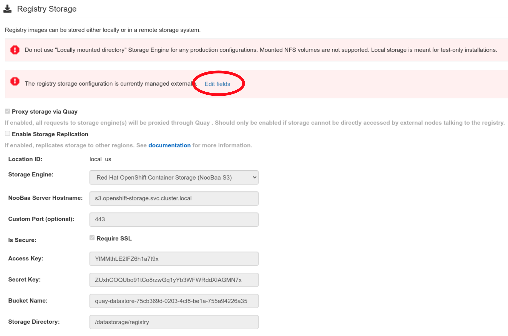
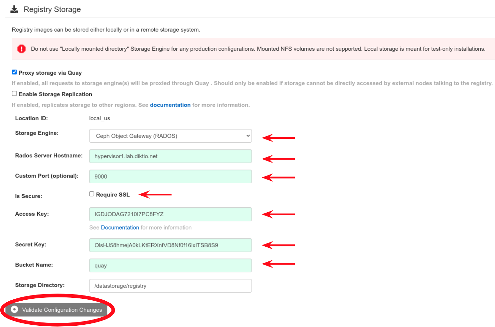

## Get the Quay config editor URL
```bash
oc get route -n quay-enterprise | egrep quay-config-editor | awk '{print $2}'
```

## Get the Quay config editor password
The user ID is "quayconfig"

Unfortunately, depending on which of the 3 editor pods you hit, you will have a different password so you will need all password handy. :(

The following will extract the 3 passwords:
```bash
for i in $(oc get secret -n quay-enterprise | egrep quay-config-editor | awk '{print $1}'); do \
  oc get secret -n quay-enterprise $i -o json | egrep password | awk -F '"' '{print $4}' | base64 -d
  echo
done
```

# Configure storage to external RGW

The following information will be required:
- Rados Server Hostname: \<ServerFqdnOrIp\>
- Custom Port (optional):	\<Port\>
- Access Key:	\<AccessKey\>
- Secret Key:	\<SecretKey\>
- Bucket Name: \<BucketName\>

Once logged into the Quay config editor then scroll down to the "Registry Storage" section and select "Edit fields" (see below).

---



---

Enter the required information as indicated by the arrows below then select "Validate Configuration Changes" (see below). Based on your RGW configuration, the the "Require SSL" setting accordingly.

---



---

A popup window will appear with a status of "CONFIGURATION VALIDATED", if not the select "Continue Editing" and correct the error before retrying. To submit the config, select "Reconfigure Quay".
---


---
